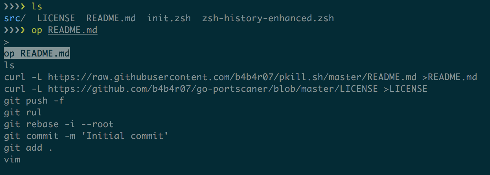

zsh-history-enhanced
====================

A history tool enhanced for zsh users



## Features

- Histroy search like [enhancd](https://github.com/b4b4r07/enhancd)
- etc...

## Installation

```zsh
zplug "b4b4r07/zsh-history-enhanced"
```

and then,

```zsh
if zplug check "b4b4r07/zsh-history-enhanced"; then
    ZSH_HISTORY_FILTER="fzy:fzf:peco:percol"
    ZSH_HISTORY_KEYBIND_GET_BY_DIR="^r"
    ZSH_HISTORY_KEYBIND_GET_ALL="^r^a"
fi
```

## Usage

- `ZSH_HISTORY_FILE`
- `ZSH_HISTORY_FILTER`
- `ZSH_HISTORY_KEYBIND_GET_BY_DIR`
- `ZSH_HISTORY_KEYBIND_GET_ALL`

## License

MIT

## Author

b4b4r07
